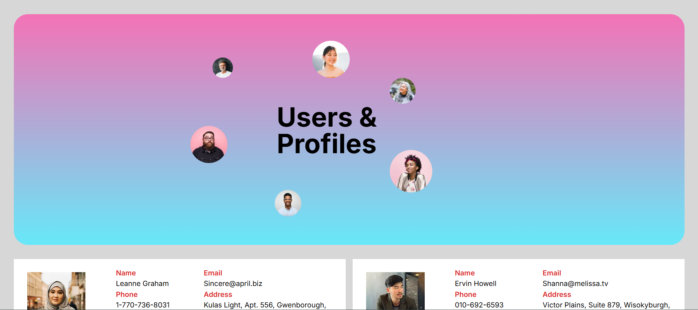

## User Data Visualization via API

## About the Project  
This is a simple web application that integrates with an external API to retrieve user data. The retrieved data is displayed on the page in the form of convenient cards, allowing users to quickly and easily view information about people.

## Technologies  
**Frontend**: HTML, CSS, JavaScript (React.js)  

**Backend**: Node.js  

**API**: External API for retrieving user data  

## Screenshots  

**Top part of the page**  

**User list**  

